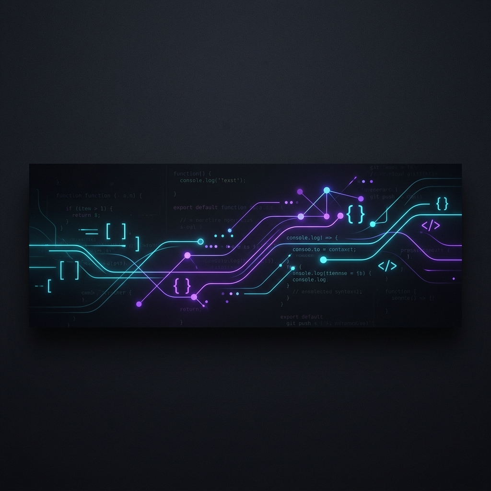
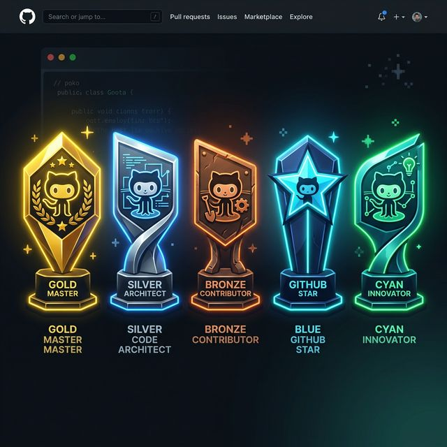

  
    
  

  
  
  

    <!-- Using generated trophy image since external service was unavailable -->
    
  

---

### 🚀 About Me
I am a passionate **Python/Django Developer** with over **2 years of experience** in building scalable backend systems. Currently, I'm a **Software Developer @ Redspark Technologies**.

- 🔭 Working on **ERP Modules, AI Age-Gender Detection, and Stock Prediction**.
- 🌱 Learning **Advanced AI/ML and Scalable Architectures**.
- 💬 Ask me about **Django, FastAPI, Web Scraping, and WebSockets**.
- 📫 Reach me at: [sohamghayal02@gmail.com](mailto:sohamghayal02@gmail.com)

---

### 🐍 My Contributions

  
  
    
  
  <!-- Contribution Snake Animation -->
  <picture>
    <source media="(prefers-color-scheme: dark)" srcset="https://raw.githubusercontent.com/soham1027/soham1027/output/github-contribution-grid-snake-dark.svg">
    <source media="(prefers-color-scheme: light)" srcset="https://raw.githubusercontent.com/soham1027/soham1027/output/github-contribution-grid-snake.svg">
    
  </picture>

---

### 💻 Tech Stack

  
  
  
  
  
  
  
  

---

### 📈 Activity Graph

  

---

### 🔗 Connect With Me

  
  

---

  

